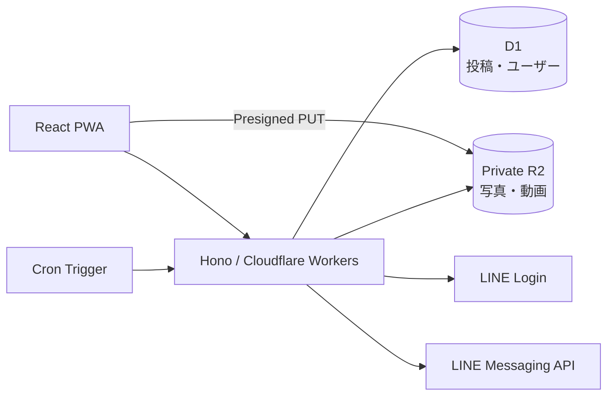

<div align="center">
  <picture>
    <source media="(prefers-color-scheme: dark)" srcset="public/icons/icon-dark-192.png">
    
  </picture>

  <h1>このごろ</h1>

  <strong>夫婦の写真や動画を、招待した家族だけで一緒に振り返る。</strong><br>
  写真が主役の、静かでプライベートな家族向けタイムライン。

  <p>
    
    
    
    
  </p>
  <p>
    <a href="https://react.dev/"></a>
    <a href="https://www.typescriptlang.org/"></a>
    <a href="https://hono.dev/"></a>
    <a href="https://developers.cloudflare.com/workers/"></a>
    
  </p>
</div>

> [!NOTE]
> 個人利用の家族限定アプリであるため、本番URLは公開していない。

## ✨ できること

| | 機能 | 内容 |
|---|---|---|
| 📷 | 写真・動画投稿 | 複数メディアを1つの思い出としてまとめ、撮影日時をもとに表示する |
| 🗓️ | イベント整理 | 旅行やお出かけをイベントとセクションで整理する |
| 👀 | みたよ | 操作不要の自動既読で、家族が見たことだけを静かに伝える |
| 💬 | コメント | いいねやランキングを持ち込まず、家族の会話だけを残す |
| 👨‍👩‍👧‍👦 | 家族招待 | 期限付きURLとLINE Loginで、招待したメンバーだけが参加する |
| 🔔 | LINE通知 | 短時間の投稿をまとめ、通知を希望する家族へ届ける |
| 🌓 | テーマ | システム・ライト・ダークを選択し、端末内へ保存する |
| 📱 | PWA | スマートフォンのホーム画面からアプリのように利用する |

権限は`owner`・`uploader`・`viewer`の3種類。閲覧者には投稿や家族管理など、不要な管理操作を表示しない。

## 🧭 設計



- フロントエンドとAPIを1つのWorkersプロジェクトで配信する
- メディアはWorkerを中継せず、署名付きURLでprivate R2へ直接アップロードする
- D1にはメタデータとR2のobject keyだけを保存する
- SessionはHttpOnly・Secure Cookie、LINE認証にはstate・nonce・PKCEを使う
- Safari PWAと外部ブラウザをまたぐLINE LoginもD1経由で引き継ぐ

詳しい思想と仕様は[`docs/00_PRODUCT_OVERVIEW.md`](docs/00_PRODUCT_OVERVIEW.md)、構成は[`docs/02_ARCHITECTURE.md`](docs/02_ARCHITECTURE.md)を参照。

## 🚀 開発を始める

### 必要なもの

- Node.js 22以降
- Cloudflareアカウント
- D1 database
- private R2 bucketと、PUT権限を持つR2 S3 API token

```sh
npm install
cp .dev.vars.example .dev.vars
npx wrangler login
npm run db:migrate
npm run dev
```

`.dev.vars`へR2の`R2_ACCOUNT_ID`・`R2_ACCESS_KEY_ID`・`R2_SECRET_ACCESS_KEY`を設定する。LINE関連の値がないローカル環境では固定の開発ユーザーを使用する。

<details>
<summary><strong>新しいCloudflare環境を作る</strong></summary>

```sh
npx wrangler d1 create konogoro
npx wrangler r2 bucket create konogoro-media
npx wrangler d1 migrations apply DB --local
```

発行されたdatabase IDとbucket名を`wrangler.jsonc`へ設定する。R2はローカル開発でもremote bindingを使い、Presigned PUT先と完了APIの確認先を一致させる。

本番migrationとR2 CORSの反映:

```sh
npx wrangler d1 migrations apply DB --remote
npm run r2:cors
```

</details>

<details>
<summary><strong>LINE Loginと通知を有効にする</strong></summary>

LINE Login ChannelとMessaging API Channelを同じProviderへ配置し、Callback URLに次を登録する。

```text
https://<本番origin>/api/auth/line/callback
```

本番Workerへ値をsecretとして登録する。値をコマンド引数やリポジトリへ書かない。

```sh
npx wrangler secret put LINE_CHANNEL_ID
npx wrangler secret put LINE_CHANNEL_SECRET
npx wrangler secret put LINE_CHANNEL_ACCESS_TOKEN
npx wrangler secret put APP_ORIGIN
npx wrangler secret put R2_ACCOUNT_ID
npx wrangler secret put R2_ACCESS_KEY_ID
npx wrangler secret put R2_SECRET_ACCESS_KEY
```

LINE公式アカウントはLINE Login Channelへリンクする。通知は友だち追加済みかつ通知ONのユーザーだけへ送信する。

</details>

## 🛠️ コマンド

| コマンド | 用途 |
|---|---|
| `npm run dev` | ViteとWorkersの開発サーバーを起動 |
| `npm run check` | 型検査・lint・テスト・本番ビルドを一括実行 |
| `npm run test` | Vitestを実行 |
| `npm run db:migrate` | ローカルD1へmigrationを適用 |
| `npm run cf-typegen` | Cloudflare binding型を再生成 |
| `npm run deploy` | ビルド・R2 CORS反映・Workersデプロイ |

## 📚 ドキュメント

| 資料 | 内容 |
|---|---|
| [Product Overview](docs/00_PRODUCT_OVERVIEW.md) | コンセプトとプロダクト思想 |
| [Requirements](docs/01_REQUIREMENTS.md) | 機能要件と権限 |
| [Architecture](docs/02_ARCHITECTURE.md) | Cloudflare・LINE・アップロード構成 |
| [UI / UX Spec](docs/04_UI_UX_SPEC.md) | 画面構成と操作仕様 |
| [Design Guide](docs/05_DESIGN_GUIDE.md) | モバイル・配色・テーマ方針 |
| [Operations](docs/08_OPERATIONS.md) | 監視、D1復旧、バックアップ |

<details>
<summary><strong>現在の上限</strong></summary>

- 対応形式: JPEG、PNG、WebP、MP4、WebM、MOV
- 1投稿: 最大30件
- 写真: 1枚25MBまで
- 動画: 1本500MBまで
- R2上の削除済みメディアは復元非対応

</details>
